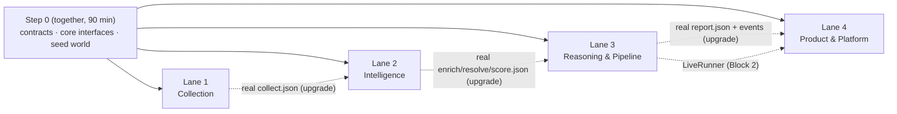

# Team Work Split — Four Independent Lanes

| Field | Value |
| --- | --- |
| Companion to | [`SHOPIFY_ECOSYSTEM_INTELLIGENCE_DESIGN.md`](./SHOPIFY_ECOSYSTEM_INTELLIGENCE_DESIGN.md) (section numbers like "design §5.4" point there) |
| Deadline | Devpost submission **Sun 2026-09-20 08:00 EDT**; we submit by **07:30** |
| Rule | Nobody waits on anybody. If you are waiting, you are using the wrong fixture. See §12 |
| Milestones | [`milestones/`](./milestones/README.md) slice this work into five shippable products with agent-ready cards |

> **Which doc wins:** the lane task tables in §4–§7 and the Block timeline describe the full core (= milestones M1 + M2). The milestone files re-cut that work into shippable increments. For **what to build next and in what order**, the milestone files win. For **ownership, Step 0, integration swaps, and working agreements**, this doc stays the source of truth.

---

## 0. The model in one paragraph

The pipeline is cut into four **lanes**. Each lane owns a slice of stages and the directories behind them. Lanes talk to each other only through:
1. the shared types in `@sei/contracts`
2. JSON files in the **run-directory format** (design §10.3)

In Step 0 we hand-write one small, coherent **seed world** (§3.3), with a fixture file for every stage. After that, every lane builds and tests against the seed files. When a lane's live output is ready, it **publishes a real run directory** and the downstream lanes switch to it. Final integration swaps one fixture stage for one live stage at a time (§8), and any swap can be undone with a flag.

---

## 1. Lanes at a glance

| | **Lane 1 — Collection** | **Lane 2 — Intelligence** | **Lane 3 — Reasoning & Pipeline** | **Lane 4 — Product & Platform** |
| --- | --- | --- | --- | --- |
| Sponsor tech | Browserbase, Shopify Catalog | Baseten (+ GPTZero) | OpenAI (+ Codex log) | Sentry, deploy, domain |
| Owns | `packages/collect` | `packages/enrich`, `packages/db`, `ml/baseten` | `packages/reason`, `packages/pipeline` | `apps/server`, `apps/web`, `packages/telemetry`, root config |
| Stages | profile (raw signals), `discover`, `collect` | `enrich`, `resolve`, `score`, bundle selection | profile (normalize), `plan`, `synthesize`, `verify`, `assemble`, LiveRunner | API, SSE, ReplayRunner, UI, deploy |
| Reads | `profile.json`, `plan.json` | `profile.json`, `discover.json`, `collect.json` | everything upstream | `report.json`, `events.jsonl` |
| Writes | `raw-signals.json`, `discover.json`, `collect.json` | `enrich.json`, `resolve.json`, `score.json` | `profile.json`, `plan.json`, `sections/*.json`, `verify.json`, `report.json` | `run.json`, `events.jsonl` (seed); server wiring |
| Prizes you carry | Browserbase, Shopify (with L4) | Baseten, GPTZero, MLH Tiger Data | OpenAI, Rox, Composio | Sentry, finalist polish, MLH GoDaddy/Vultr |
| Demo role | Narrates live browsing + Shopify Catalog | Baseten numbers + how scoring works | Citations, messy-data handling, actions, Codex story | Drives the laptop, owns the backup video |

---

## 2. Dependency picture



**Solid edges are the only hard dependencies**, and they are all satisfied at the end of Step 0. Dotted edges are upgrades: until one arrives, you keep working on seed or earlier real fixtures.

---

## 3. Step 0 — together (Sat 12:00–13:30, 90 minutes)

### 3.1 Minutes 0–25: scaffold (L4) and access spikes (L1–L3), in parallel

**L4 scaffold checklist** (push to `main` at minute 25):
- [ ] `pnpm-workspace.yaml` (`apps/*`, `packages/*`), root `package.json` (scripts below), `tsconfig.base.json` (strict, ES2022, `moduleResolution: "bundler"`, paths `@sei/*`), `vitest.config.ts`, `.gitignore` (`.env`, `.data/`, `node_modules/`, `dist/`), `.env.example` (copy design §3.6), `CODEOWNERS` (§11.2), `.github/workflows/ci.yml` (install → typecheck → test).
- [ ] Packages with `package.json` + `src/index.ts`: `contracts`, `core`, `collect`, `enrich`, `reason`, `pipeline`, `db`, `telemetry`.
- [ ] **Per-lane stub files** so nobody edits the same file during Step 0, each re-exported from its package's `index.ts`:
  - `packages/contracts/src/`: `common.ts` (L4), `collect.ts` (L1), `enrich.ts` (L2), `profile.ts` · `plan.ts` · `report.ts` (L3), `run.ts` · `api.ts` (L4)
  - `packages/core/src/`: `context.ts` · `pipeline.ts` · `reason.ts` (L3), `collect.ts` (L1), `enrich.ts` · `store.ts` (L2), `telemetry.ts` (L4)
- [ ] `apps/server`: Hono hello on `:8787` with `/healthz`. `apps/web`: Vite React hello proxying `/api` to `:8787`. `pnpm dev` runs both.
- [ ] `docs/CODEX_LOG.md` with the header `| Time | Lane | Task | What Codex did | Outcome |`.

Root scripts (all `tsx`, no bash, so they work on Windows):

```json
{
  "scripts": {
    "dev": "pnpm --parallel --filter \"./apps/*\" dev",
    "test": "vitest run",
    "typecheck": "pnpm -r exec tsc --noEmit",
    "fixtures:check": "vitest run packages/contracts",
    "collect:profile": "tsx packages/collect/src/cli/profile.ts",
    "collect:discover": "tsx packages/collect/src/cli/discover.ts",
    "collect:run": "tsx packages/collect/src/cli/collect.ts",
    "enrich:run": "tsx packages/enrich/src/cli/enrich.ts",
    "enrich:resolve": "tsx packages/enrich/src/cli/resolve.ts",
    "enrich:score": "tsx packages/enrich/src/cli/score.ts",
    "reason:profile": "tsx packages/reason/src/cli/profile.ts",
    "reason:plan": "tsx packages/reason/src/cli/plan.ts",
    "reason:synth": "tsx packages/reason/src/cli/synthesize.ts",
    "pipeline:run": "tsx packages/pipeline/src/cli/run.ts",
    "eval": "tsx evals/run-eval.ts"
  }
}
```

**Access spikes.** Save raw responses under `fixtures/spikes/<provider>/`. Your parsers will be tested against them.

| Lane | Spike | Decision it unlocks |
| --- | --- | --- |
| L1 | `bb.search.web({ query, numResults: 5 })` | Search response shape |
| L1 | `bb.fetchAPI.create` on a real Shopify store: `/products.json` (`raw`) + homepage (`markdown`) | Fetch shape; fingerprint inputs |
| L1 | One Stagehand session on a product page with a reviews widget: `extract` reviews, read the session ID and live-view URL | Stagehand v4 return shapes; live view works |
| L1 | Global Catalog `search_catalog` JSON-RPC with Shopify's example agent profile URL | **Does it work without registration?** Exact `result` shape. If blocked → discovery falls back to BB Search (design §5.4) |
| L1 | Read `robots.txt` + terms for 2 candidate forum domains | Open decision #2 (approved forum) |
| L2 | `GET https://inference.baseten.co/v1/models` | Candidate tagger models |
| L2 | Tagger prompt on 10 seed texts (§3.3) against 2 models; compare JSON validity + latency | `BASETEN_TAGGER_MODEL` |
| L2 | **Start the BEI embedding deployment now** (it's the long pole); call it once it's live | `BASETEN_EMBED_BASE_URL` / `BASETEN_EMBED_MODEL` |
| L3 | `responses.parse` + `zodTextFormat` with a nested schema using `.nullable()` fields | Zod version compatibility (`zod` vs `zod/v3`), model IDs |
| L3 | `responses.create` with `tools: [{ type: 'web_search' }]` | Fallback search works |
| All | Keys in your local `.env` (shared out of band, never committed); Codex set up | — |

### 3.2 Minutes 25–70: contracts and seed fixtures (each lane edits only its own files)

Transcribe design §4 into Zod in your own contract file, then write your seed fixture files. **Use Codex for the transcription and log it**; that's a legitimate, concrete Codex contribution.

| Output | Owner |
| --- | --- |
| `contracts/src/collect.ts` (`ShopifySignals`, `ProductSummary`, `RawStoreSignals`, `CatalogProduct`, `SearchHit`, `Candidate`, `DiscoveryResult`, `Capture`, `Source`, `Evidence`, `CollectionBatch`) · `core/src/collect.ts` (`CatalogProvider`, `SearchProvider`, `PageFetcher`, `BrowserRunner`, `SourceAdapter`, `CollectTarget`, `CollectTools`, `PolicyChecker`, `FetchedPage`, `BrowserSession`, `CatalogQuery`) | **L1** |
| `fixtures/seed/northbound/raw-signals.json`, `discover.json`, `collect.json` | **L1** |
| `contracts/src/enrich.ts` (`Enrichment`, `Entity`, `DiscourseCluster`, `ScoreComponent`, `CandidateScore`, `ResolveResult`, `TagInput`, `TagOutput`) · `core/src/enrich.ts` (`Embedder`, `Tagger`, `EvidenceScorer`, `Adjudicator`, `ComponentJudge`) · `core/src/store.ts` (`RunStore`, `EvidenceStore`, `VectorIndex`) | **L2** |
| `fixtures/seed/northbound/enrich.json`, `resolve.json`, `score.json` (vectors from the hashing embedder, rounded to 4 decimals) | **L2** |
| `contracts/src/profile.ts` (`StoreProfile`), `plan.ts` (`ResearchTask`, `ResearchPlan`), `report.ts` (`Claim`, all section types, `ReportSection`, `EvidencePreview`, `Report`, `RunStats`, `VerificationResult`, `SynthesisInput`, action types) · `core/src/context.ts` (`RunContext`, `BudgetTracker`, `RunBudget`, `FeatureFlags`, `RequestCache`, `Logger`), `pipeline.ts` (`Stage`, `StageIO`, `StageOutputs`, `PipelineRunner`), `reason.ts` (`Reasoner`, `SectionSynthesizer`, `Verifier`, `ActionProvider`) | **L3** |
| `fixtures/seed/northbound/profile.json`, `plan.json`, `report.json` (sections embedded), `verify.json` · `packages/contracts/test/seed-integrity.test.ts` (every cited evidence ID / entity ID resolves across files) | **L3** |
| `contracts/src/common.ts` (`newId`, `Money`, `SourceType`, `SCHEMA_VERSION`), `run.ts` (`ReportRun`, `RunStatus`, `StageKey`, `PipelineEvent`, `PipelineEventInput`), `api.ts` (request/response DTOs, error envelope) · `core/src/telemetry.ts` | **L4** |
| `fixtures/seed/northbound/run.json`, `events.jsonl` (~40 events across ~90 s using the seed IDs) | **L4** |

L4 owns `common.ts`, which everyone imports. L4 pushes it by **minute 35** and others use local placeholders until then.

### 3.3 The seed world ("Northbound Coffee Co.")

Everyone writes fixtures against **these exact IDs and texts** so the files agree without coordination. All domains use the reserved `.example` TLD, so the data is clearly fictional.

**Merchant:** Northbound Coffee Co. · `northbound-coffee.example` · `prof_seed` v2 (confirmed) · specialty whole-bean coffee roasted to order in Toronto · price band $18–$32 per 340 g bag (median $24) · geography CA, US · Shopify confidence 0.95 · run `run_seed`.

**Entities and candidates:**

| Entity | Candidate | Name | Domain | Role in seed | What it demonstrates |
| --- | --- | --- | --- | --- | --- |
| `ent_self` | — | Northbound Coffee Co. | `northbound-coffee.example` | self | — |
| `ent_kettle` | `cand_kettle` | Kettle & Pour | `kettleandpour.example` | collaborator #1 | Gooseneck kettles $65–$140; bundle "Brew Starter Kit" |
| `ent_clay` | `cand_clay` | Claywork Studio | `clayworkstudio.example` | collaborator #2 | Handmade mugs $28–$48; gift-with-purchase |
| `ent_oat` | `cand_oat` | Oat Harbor | `oatharbor.example` | collaborator #3 | Barista oat milk; co-marketing latte content; `low_evidence` (1 source) |
| `ent_summit` | `cand_summit` | Summit Roast | `summitroast.example` | competitor, direct | Complaints + praise (contradiction) |
| *(merged)* | `cand_summit_shop` | Summit Roast Shop | `shop.summitroast.example` | merges into `ent_summit` | Merge rule "same registrable domain" |
| `ent_summitgear` | `cand_summitgear` | Summit Gear Co. | `summitgear.example` | neither (camping gear) | **Refused merge** with Summit Roast (name similarity only) |
| `ent_pods` | `cand_pods` | Daily Grind Pods | `dailygrindpods.example` | competitor, substitute | Switching trigger |
| `ent_beanbox` | `cand_beanbox` | BeanBox Club | `beanboxclub.example` | competitor, adjacent | Unmet need |

**Sources:**

| Source | URL | Type | Capture |
| --- | --- | --- | --- |
| `src_seed_01` | `https://northbound-coffee.example/products.json` | storefront | fetch |
| `src_seed_02` | `https://northbound-coffee.example/pages/about` | storefront | fetch |
| `src_seed_03` | `https://kettleandpour.example/products/gooseneck-kettle-1l` | shopify_catalog | catalog_mcp |
| `src_seed_04` | `https://brewguide.example/best-pour-over-kettles` | editorial | fetch |
| `src_seed_05` | `https://clayworkstudio.example/products/stoneware-mug` | shopify_catalog | catalog_mcp |
| `src_seed_06` | `https://oatharbor.example/products/barista-6-pack` | shopify_catalog | catalog_mcp |
| `src_seed_07` | `https://summitroast.example/products/signature-blend` | product_reviews | stagehand (`browserbaseSessionId: "seed-session-1"`) |
| `src_seed_08` | `https://coffeeforum.example/t/pods-vs-beans` | forum | browser |
| `src_seed_09` | `https://brewguide.example/pods-vs-whole-bean` | editorial | fetch |
| `src_seed_10` | `https://beanboxclub.example/pages/reviews` | product_reviews | stagehand (`"seed-session-2"`) |

**Evidence** (exact texts; `authorHash` values are arbitrary strings):

| ID | Source | Kind | About | Text |
| --- | --- | --- | --- | --- |
| `ev_seed_01` | 01 | product_record (first-party) | self | "Northbound House Espresso — whole bean, 340 g, $24.00. Roasted to order." |
| `ev_seed_02` | 02 | about (first-party) | self | "We roast every Monday in small batches in Toronto and ship within 48 hours of roasting." |
| `ev_seed_03` | 03 | product_record | kettle | "Kettle & Pour Gooseneck Kettle 1L — $89.00. Rating 4.7/5 from 1,204 ratings. Ships to CA, US." |
| `ev_seed_04` | 04 | article_paragraph | kettle | "The Kettle & Pour gooseneck is our top pick for beginners: steady flow and a built-in thermometer." |
| `ev_seed_05` | 05 | product_record | clay | "Claywork Studio Handmade Stoneware Mug — $36.00. Rating 4.9/5 from 318 ratings. Ships to CA." |
| `ev_seed_06` | 06 | product_record | oat | "Oat Harbor Barista Oat Milk 6-pack — $29.00. Rating 4.5/5 from 842 ratings. Ships to CA, US." |
| `ev_seed_07` | 07 | review (2/5) | summit | "Bags arrived with a roast date six weeks old. Tasted flat." |
| `ev_seed_08` | 07 | review (5/5) | summit | "Love that I can skip or pause my Summit subscription anytime." |
| `ev_seed_09` | 07 | review (2/5) | summit | "Second order in a row with an old roast date. Switching to a local roaster." |
| `ev_seed_10` | 08 | comment | pods | "I switched from pods to whole beans because the pods all taste the same and the waste bugged me." |
| `ev_seed_11` | 08 | comment | category | "Specialty beans are great but shipping costs almost as much as the bag." |
| `ev_seed_12` | 09 | article_paragraph | pods | "Daily Grind Pods are convenient, but a bag of fresh whole beans costs about half as much per cup." |
| `ev_seed_13` | 10 | review (3/5) | beanbox | "I wish BeanBox told me the roast date for each coffee before it ships." |
| `ev_seed_14` | 10 | review (4/5) | beanbox | "Great variety, but I never know which roaster or roast date I'm getting." |
| `ev_seed_15` | 08 | comment | summit | "Summit Roast's subscription is the most flexible one I've found." |
| `ev_seed_16` | 04 | article_paragraph | summitgear | "Summit Gear's camp kettle is sturdy, but it isn't built for pour-over." |

**Clusters** (L2's `resolve.json`):

| Cluster | Entity | Type | Evidence | Label |
| --- | --- | --- | --- | --- |
| `clu_stale` | summit | complaint | 07, 09 | roast date freshness |
| `clu_flex` | summit | praise | 08, 15 | subscription flexibility |
| `clu_pods_switch` | pods | switching_trigger | 10, 12 | taste and cost vs pods |
| `clu_roast_transparency` | beanbox | unmet_need | 13, 14 | roast date transparency |
| `clu_shipping` | category | complaint | 11 | shipping cost (weak signal, singleton) |

**Report highlights** (L3's `report.json`; L4 designs the UI around these):
- **Collaborators:** Kettle & Pour → *bundle* "Brew Starter Kit" (cites 03, 04, 01); Claywork Studio → *gift-with-purchase* mug on orders over $60 (cites 05, 01); Oat Harbor → *content* "Northbound latte guide" (cites 06; `low_evidence`).
- **Competitors:** Summit Roast (direct; strength: flexible subscription 08, 15; weakness: stale roast dates 07, 09); Daily Grind Pods (substitute; 10, 12); BeanBox Club (adjacent; 13, 14).
- **SWOT:**
  - Strength: roast-to-order within 48 h (02, 01), which answers competitors' stale-date complaints (07, 09).
  - Weakness: no subscription evidence (`inference`, reasoning given).
  - Opportunities: roast-date transparency (13, 14); pod switchers (10, 12).
  - Threats: shipping cost sensitivity (11); Summit's flexible subscription (08, 15).
- **Actions:**
  1. Print roast date plus "ships within 48 h" on product pages (falsification test: A/B the product page for 2 weeks).
  2. Pilot the Brew Starter Kit with Kettle & Pour.
  3. Test a free-shipping threshold at $45.
- **Warnings:** one `insufficientEvidence` entry (`"weaknesses: pricing vs competitors"`), and the refused merge `ent_summitgear` is visible in `resolve.json`.

### 3.4 Minutes 70–90: review and freeze

- [ ] `pnpm typecheck && pnpm test` green: every seed file validates, and `seed-integrity.test.ts` passes.
- [ ] 3-minute walkthrough per lane: "here is the file I produce, here is the one field you're most likely to misread".
- [ ] Tag `contracts-v1.0.0`. **M0 reached.** From here, contract changes follow §11.3.

---

## 4. Lane 1 — Collection (Browserbase + Shopify)

**Mission:** turn a URL and a research plan into Shopify-verified candidates and clean, quotable, provenance-rich evidence.
**You own:** `packages/collect`.
**You consume:** `profile.json`, `plan.json` (seed now; for live testing, hand-write `fixtures/dev/<store>/profile.json` and `plan.json` for one real store, taking 6–8 real catalog queries from design §5.3).
**You produce:** `collectStoreSignals(url, ctx)`; stages `discover` and `collect`; `createCollectStages(env)` for the composition root; fakes `FixtureCatalogProvider`, `FixtureSearchProvider`, `FixturePageFetcher`, `FixtureBrowserRunner` (read `fixtures/spikes/`) for your own tests.

### Block 1 (13:30–20:00)

| # | Pri | Task | Est | Done when |
| --- | --- | --- | --- | --- |
| 1 | P0 | `url-safety.ts`: canonicalize, strip tracking params, reject unsafe hosts (design §5.0); registrable domain via `tldts` | 45m | Table test of 12 URLs passes |
| 2 | P0 | `browserbase.ts`: `search`, `fetch` (cache-wrapped), `withSession` (Stagehand `env: 'BROWSERBASE'`, session ID, live-view URL, emits `browser.session` / `browser.session.closed`, `close()` in `finally`); `policy.ts` robots via `robots-parser` + `policy.json` allow/deny | 90m | Spike calls go through the wrapper; a killed session still emits `closed` |
| 3 | P0 | `shopify/fingerprint.ts` + `shopify/storefront.ts` → `collectStoreSignals`; CLI `pnpm collect:profile <url> --out <dir>` | 75m | Real store → valid `raw-signals.json`, confidence ≥ 0.9; a non-Shopify site → < 0.3 |
| 4 | P0 | `shopify/catalog.ts` (UCP JSON-RPC client → `CatalogProduct[]`); `discover/aggregate.ts` (group by `seller.domain` → `Candidate`); `discover/stage.ts` (catalog + BB Search + qualify, design §5.4); CLI `pnpm collect:discover --run-dir <dir>` | 90m | ≥ 10 candidates with seller domains for the real dev store; merchant's own domain excluded |
| 5 | P0 | Adapters: `storefront`, `editorial` (Fetch markdown → paragraphs mentioning the subject), `reviews-widget` (Stagehand `observe` → `act` "load more" ≤ 3 → `extract` a Zod `ReviewList`) | 120m | Each adapter has a replay test on spike data; reviews-widget works on 2 real widget vendors |
| 6 | P0 | `collect/stage.ts`: targets from candidates + hits, escalation ladder, `p-limit` pools, per-domain budget, circuit breaker, `contentHash` dedupe; CLI `pnpm collect:run --run-dir <dir>` | 60m | Valid `collect.json` with ≥ 80 evidence units, ≥ 1 `stagehand` capture, in < 120 s |
| 7 | P0 | **Publish real data:** copy the dev run to `fixtures/real/<store>/` (`profile`, `plan`, `discover`, `collect`) after `pnpm fixtures:check` | 15m | Committed **by 18:00**, so L2 has real text |

**M1 exit check (20:00):** `pnpm collect:discover` and `pnpm collect:run` against `fixtures/dev/<store>` succeed live; `fixtures/real/<store>/collect.json` is on `main`.

### Block 2 (20:00–23:30)
- Drive swaps **I1** (raw signals) and **I2** (discover + collect inside the LiveRunner) in §8.
- Tune budgets so discover + collect take ≤ 90 s on the demo stores. Turn on the cache.

### Block 3 stack-ups (priority order, only after M2)
1. Capture metadata polish: `replayUrl` for every session-captured evidence item; screenshot artifact for the drawer (Browserbase prize).
2. `FEATURE_POLICIES`: extract competitor shipping and returns thresholds (Stagehand on `/policies/shipping-policy`), feeding SWOT threats.
3. Forum adapter for the approved domain (only if decision #2 approved one).
4. Build `evals/golden-stores.json` with 3–4 stores that run cleanly live.

### Block 4
Own the live-run segment: know which store to run for each judge. Keep the fallback store name ready.

### Do not
Bypass blocks, CAPTCHAs, or logins · summarize with an LLM during collection (Stagehand `extract` only pulls structured fields) · write any file other than yours in a run directory · store author names or handles.

---

## 5. Lane 2 — Intelligence (Baseten + data)

**Mission:** turn raw evidence into tagged, embedded, deduplicated entities, discourse clusters, and explainable scores, cheaply and at volume.
**You own:** `packages/enrich`, `packages/db`, `ml/baseten`.
**You consume:** `profile.json`, `discover.json`, `collect.json` (seed now; `fixtures/real/<store>/` from L1 by ~18:00).
**You produce:** stages `enrich`, `resolve`, `score`; `selectBundle(...)` (used by L3); `Adjudicator` + `ComponentJudge` implementations (your prompts, run through the `Reasoner` interface); `createEnrichStages(env)`; Pg stores (later).

### Block 1 (13:30–20:00)

| # | Pri | Task | Est | Done when |
| --- | --- | --- | --- | --- |
| 1 | P0 | `baseten/tagger.ts` `BasetenTagger`: OpenAI SDK with `baseURL = BASETEN_MODEL_API_BASE_URL`, 10 units per call, `json_schema` or `json_object` + Zod, one repair retry, split batch on timeout. Fake: `RuleTagger` (keyword rules) | 90m | 50 real units tagged with ≥ 95% schema-valid; the fake reproduces the seed labels |
| 2 | P0 | `baseten/embedder.ts` `BeiEmbedder` (OpenAI-compatible `/v1/embeddings` on the BEI URL). Fake: `HashingEmbedder` (unigram+bigram feature hashing → 512 dims, L2-normalized: deterministic, and similar text gives similar vectors) | 30m | Cosine of two paraphrases > cosine of two unrelated texts, for both implementations |
| 3 | P0 | `enrich/stage.ts`: filters, tag, **quote substring validation**, embed, >50%-failure fallback to OpenAI (design §5.6); CLI `pnpm enrich:run --run-dir <dir> [--fake]` | 60m | Valid `enrich.json`; records model IDs; first-party units skipped for sentiment |
| 4 | P0 | `resolve/entities.ts` (merge rules in order, evidence attachment, `mergeLog`, `refusedMerges`), `resolve/cluster.ts` (agglomerative, cosine, average linkage, threshold 0.78), `resolve/stage.ts`; CLI | 120m | On seed: Summit Roast Shop merges into Summit Roast; Summit Gear is **refused**; the 5 seed clusters come out |
| 5 | P0 | `score/*.ts`: computed components exactly as design §7, penalties, evidence strength; `ComponentJudge` hook; CLI `pnpm enrich:score` | 75m | Seed ranking: Kettle > Clay > Oat, Summit > Pods > BeanBox; every component has a rationale |
| 6 | P0 | `prompts/adjudicate.v1.ts`, `prompts/judge.v1.ts` + `ReasonerAdjudicator`, `ReasonerComponentJudge`. Test with an inline fake `Reasoner`; switch to L3's `OpenAIReasoner` once it's on `main` | 45m | Unit tests pass with the fake |
| 7 | P1 | `bundle/select.ts`: MMR (λ 0.7) with the diversity constraints and token cap in design §9.2 | 45m | L3 can call `selectBundle('collaborators', …)` and gets ≤ cap tokens, ≥ 25% non-first-party |

**M1 exit check (20:00):** `pnpm enrich:run --run-dir fixtures/seed/northbound --fake` (then resolve, score) reproduces the seed semantics. `pnpm enrich:run --run-dir fixtures/real/<store>` with live Baseten has ≥ 90% `status: ok`.

### Block 2 (20:00–23:30)
- Drive swap **I3** (enrich → resolve → score live inside the LiveRunner).
- Publish `fixtures/real/<store>/{enrich,resolve,score}.json` as soon as they're good, for L3.
- Start `packages/db` (Drizzle schema per design §10.1, migrations, `PgRunStore`, `PgEvidenceStore`, `PgVectorIndex`). **Not needed for M2**, because `STORE=file` works.

### Block 3 stack-ups (priority order)
1. **Baseten distillation** (`FEATURE_DISTILLED_TAGGER`, design §6.2): gold labels from L3's `Reasoner` (reasoning model) → fine-tune on an H100 workstation → BEI classification deploy → `DistilledTagger` → comparison table. This is the Baseten prize story.
2. **GPTZero** (`FEATURE_GPTZERO`): an `EvidenceScorer` that writes `scores.ai_generated` (down-weights, never deletes) and a `Verifier` that checks report claims and citations. Confirm endpoints at the booth.
3. BEI reranker inside `selectBundle`.
4. Finish the Pg stores; with a hosted DB, switch deploy to `STORE=pg`.
5. `FEATURE_TRENDS`: a Tiger Data hypertable of dated discourse mentions → one trend series per competitor for L4.

### Block 4
Produce the Baseten numbers from `RunStats` (units tagged, p50 latency per batch, $/1k units vs the OpenAI estimate) for the Devpost and demo.

### Do not
Modify `Evidence.text` · merge entities on name similarity alone · drop a vector's model ID · make product claims (that's L3).

---

## 6. Lane 3 — Reasoning & Pipeline (OpenAI)

**Mission:** plan the research, write the cited report, guarantee every claim resolves to evidence, and own the runner that ties all stages together.
**You own:** `packages/reason`, `packages/pipeline`, and the curation of `docs/CODEX_LOG.md`.
**You consume:** `raw-signals.json` (L1), `enrich/resolve/score.json` (L2), and `selectBundle` from L2 (until it lands, use a naive top-K by `relevance`).
**You produce:** `normalizeProfile`; stages `plan`, `synthesize`, `verify`, `assemble`; `OpenAIReasoner`; `LiveRunner`; `FileRunStore`; `FixtureStage`; `createReasonStages(env)`; `pnpm pipeline:run`.

### Block 1 (13:30–20:00)

| # | Pri | Task | Est | Done when |
| --- | --- | --- | --- | --- |
| 1 | P0 | `openai/reasoner.ts` `OpenAIReasoner`: `responses.parse` + `zodTextFormat`, timeouts (90 s / 30 s), 2 retries on 429/5xx, request-ID logging, token accounting. `FixtureReasoner` returns canned outputs by call name | 60m | Merged to `main` early; L2 switches to it |
| 2 | P0 | Prompt registry (design §6.3) + `profile.normalize` (price band computed in code, `needsConfirmation` rules) + CLI `pnpm reason:profile --raw <file> --out <dir>` | 45m | L1's real `raw-signals.json` → sensible `profile.json` |
| 3 | P0 | `plan.research` + `plan/stage.ts` + CLI `pnpm reason:plan --run-dir <dir>` | 45m | Real profile → ≤ 40 tasks with product-language catalog queries; no brand names in catalog queries |
| 4 | P0 | `synth/collaborators.ts`, `synth/competitors.ts`, `synth/discourse.ts`: LLM schemas (`.nullable()`, never `.optional()`), mappers to domain types, `registerSection()` registry; the evidence bundle rendered as `<evidence>` blocks (design §9.2) | 120m | On seed data, the output matches the seed report's highlights |
| 5 | P0 | `verify/citations.ts` (IDs must be in **that call's** bundle; inference needs reasoning; >30% dropped → one retry with errors) + `assemble/stage.ts` (`evidenceIndex`, entities map, `RunStats`, run status rules) | 75m | Property test: an injected fake evidence ID is always dropped; `citationCoverage` = 1.0 on seed |
| 6 | P0 | `packages/pipeline`: stage registry, `LiveRunner` (topological order, checkpoint per stage, `--from/--until`, events, budget, `AbortSignal`, soft/hard deadlines), `FileRunStore` (design §10.3 layout + `EventEmitter` for `subscribe`), `FixtureStage` (serves `<stage>.json` from any run directory); CLI `pnpm pipeline:run --run-dir <dir> [--from s] [--until s] [--fake plan,discover,...]` | 120m | Fully faked run reproduces the seed `report.json`; rerun with `--from synthesize` skips upstream work |
| 7 | P1 | `synth/swot.ts`, `synth/actions.ts` | 45m | Seed SWOT/actions match §3.3 |
| 8 | P1 | `verify/consistency.ts` | 30m | Flags an entity that appears as both collaborator and direct competitor |

**M1 exit check (20:00):** `pnpm pipeline:run --run-dir <copy of seed> --fake plan,discover,collect,enrich,resolve,score` runs **live OpenAI synthesis** on seed data, producing a valid `report.json` with `citationCoverage = 1.0`.

### Block 2 (20:00–23:30): integration captain
- Call the order of swaps in §8 and keep the "what's live" table in the team channel current.
- Drive **I1** (with L1: raw → normalize) and **I4** (synthesize → verify → assemble live).
- Hand the `LiveRunner` to L4 for **I5** by 22:30 at the latest.

### Block 3 stack-ups (priority order)
1. **Actions** (`FEATURE_ACTIONS`): `action.draft` prompt, `clipboard` provider, `POST /api/runs/:id/actions` handler logic (L4 wires the route and the button). Rox's "take meaningful action" criterion.
2. **Composio** `ActionProvider` (`FEATURE_COMPOSIO`): creates a Gmail **draft** from an approved outreach.
3. **Ask the evidence** (`FEATURE_ASK`): retrieval via L2's `selectBundle` with the question as the query → `ask.answer` with cited claims.
4. Prompt quality pass on 2 real stores; bump prompt versions.

### Block 4
Curate `docs/CODEX_LOG.md` into the Devpost "How Codex helped" section, with one concrete story for the OpenAI judges.

### Do not
Let the model name final candidates (only discovery does) · let the model compute scores or price bands · accept a citation that wasn't in that call's bundle · put evidence in prompts without `<evidence>` delimiters.

---

## 7. Lane 4 — Product & Platform

**Mission:** make the pipeline visible, trustworthy, and demo-proof: API, live progress, report UI, evidence drawer, deploy, observability.
**You own:** `apps/server`, `apps/web`, `packages/telemetry`, root config, `docs/DEMO_SCRIPT.md`.
**You consume:** `report.json` + `events.jsonl` (seed now, `fixtures/real/*` later); the `PipelineRunner` interface (ReplayRunner now, L3's LiveRunner in Block 2).
**You produce:** everything a judge sees.

### Block 1 (13:30–20:00)

| # | Pri | Task | Est | Done when |
| --- | --- | --- | --- | --- |
| 1 | P0 | `apps/server`: routes from design §11, `providers.ts` composition root (env switches; calls each lane's `create*Stages(env)` once they exist), `MemoryRunStore` (yours, until L3's `FileRunStore` lands), error envelope. Fake profile path: `POST /api/profiles` returns the seed profile after 2 s | 60m | `curl` walkthrough of every route against the seed |
| 2 | P0 | `ReplayRunner` (implements `PipelineRunner`): reads a run directory, re-emits `events.jsonl` with original delays × `REPLAY_SPEED` into the RunStore, and makes sections visible on `section.ready` | 45m | Replay of the seed takes ~90 s at speed 1 and ~9 s at speed 10 |
| 3 | P0 | SSE `GET /api/runs/:id/events`: `listEvents(afterSeq)` then `subscribe`, `Last-Event-ID` resume, 15 s heartbeat | 45m | Refreshing mid-run resumes without duplicates |
| 4 | P0 | Web shell: routes (design §12.1), API client, TanStack Query, `useRunEvents` reducer, Tailwind + shadcn setup, a Polaris-like visual language | 45m | Navigation works end to end on replay |
| 5 | P0 | Intake + Profile review (Shopify confidence badge listing signals; editable chips; `needsConfirmation` callouts) | 75m | Edits create a new profile version (via API) |
| 6 | P0 | Live run: `StageTimeline`, `LiveBrowserPanel` (iframe of `liveViewUrl` when present, animated placeholder otherwise), `DiscoveryFeed` (candidates, evidence counts, merges, warnings) | 90m | The seed replay looks alive |
| 7 | P0 | Report: header stats, three tabs, `CandidateCard`, `ScoreBar` (hover shows component rationale + method), `ClaimText` + citation chips, `EvidenceDrawer` (quote highlighted in context, capture method, **Watch capture**), `ThemeList` with sample labels, `SwotGrid`, `ActionCard`; generic renderer for unknown section keys | 150m | Every chip on the seed report opens the right evidence; `low_evidence` and inference claims look different |
| 8 | P1 | Dockerfile (multi-stage: build web into `apps/server/public`) + `docker-compose.yml` (server + optional Postgres + Caddy); **deploy the replay-only build** so a public URL exists early | 60m | Public HTTPS URL serves the seed replay |

**M1 exit check (20:00):** with `RUNNER=replay pnpm dev`, paste any URL → seed profile → confirm → the replay streams → all three tabs render → every citation opens its evidence.

### Block 2 (20:00–23:30)
- Drive **I5**: `providers.ts` switches to the live profile path (L1 + L3) and the `LiveRunner` (L3) with `STORE=file`. The UI runs a real store end to end.
- Drive **I6**: record the first good real run into `fixtures/real/<store>/`, and make it selectable as a "demo store" chip.

### Block 3 stack-ups (priority order)
1. **Sentry** (first, it's cheap): `@sentry/node` ≥ 10.28 (tracing, `openAIIntegration()`, logs, spans per stage/provider via `packages/telemetry`) + `@sentry/react` (tracing, Session Replay). Keep `recordInputs/recordOutputs` off outside dev. Write down one real thing Sentry revealed, for the demo.
2. Domain (GoDaddy Registry) + HTTPS + serve `/ucp/agent-profile.json`, then give L1 the URL for `SHOPIFY_UCP_AGENT_PROFILE_URL`.
3. Actions UI (Draft → edit → approve → copy / send-to-Composio) once L3's handler exists.
4. `FEATURE_EXPLORER`: evidence table with filters + Markdown export of the report.
5. Visual polish pass: empty states, loading skeletons, mobile width.

### Block 4
Own `docs/DEMO_SCRIPT.md`, the demo laptop, and the backup MP4 (recorded from a replay). Assemble the Devpost page (screenshots, architecture image, sponsor sections written by each lane).

### Do not
Call vendor APIs from the browser · put secrets in `VITE_*` (except the Sentry DSN) · block any UI work on live data (replay exists for this).

---

## 8. Block 2 — integration sequence (20:00–23:30)

Each swap replaces **one** fixture stage with its live stage. If a swap fails, flip its flag back (`--fake <stage>` or the provider env var) and keep going. Nobody else stalls.

| Swap | Driver (+ support) | Command | Pass criteria | If it fails |
| --- | --- | --- | --- | --- |
| **I1** Profile live | L1 (+ L3) | `pnpm collect:profile <url> --out .data/dev/<slug>` then `pnpm reason:profile --raw .data/dev/<slug>/raw-signals.json --out .data/dev/<slug>` | Valid profile in < 30 s; badge and categories look right | Hand-edit `profile.json`; continue |
| **I2** Plan → discover → collect live | L1 (+ L3) | `pnpm pipeline:run --run-dir .data/dev/<slug> --until collect` | ≥ 10 candidates, ≥ 80 evidence, ≥ 1 session, < 150 s | `--fake discover` with the L1 real fixture |
| **I3** Enrich → resolve → score live | L2 | `pnpm pipeline:run --run-dir .data/dev/<slug> --from enrich --until score` | ≥ 90% enrichment ok; ≥ 3 theme clusters; every candidate scored | `ENRICH_PROVIDER=openai` or `--fake enrich` |
| **I4** Synthesize → verify → assemble live | L3 | `pnpm pipeline:run --run-dir .data/dev/<slug> --from synthesize` | Every section `ready`/`partial`; `citationCoverage = 1.0` | Retry per section; ship `partial` |
| **I5** Server on the live runner | L4 (+ L3) | `RUNNER=live STORE=file pnpm dev` → UI flow on a real store | Browser shows live view, sections arrive, report renders | `RUNNER=replay` for the demo |
| **I6** Record | L4 (+ L1) | Copy `.data/runs/<runId>` → `fixtures/real/<slug>/`; `pnpm fixtures:check` | Replays identically; chip added in UI | Keep the seed as the demo fallback |

**M2 (23:30):** I1–I6 pass for at least one real store. Only then does anyone start a stack-up.

---

## 9. Block 3 — stack-up menu (choose at M2, 23:30–04:00)

Every stack-up is flag-gated and lives inside one lane, so they can be built in parallel and dropped independently.

| Stack-up | Lane | Est | Prize | Needs |
| --- | --- | --- | --- | --- |
| Sentry tracing + AI monitoring + logs + replay | L4 | 1 h | Sentry | — |
| Actions: drafts + approval UI | L3 + L4 | 2 h | Rox, Shopify | M2 |
| Composio Gmail draft | L3 | 1 h | Composio, Rox | Actions |
| Baseten distillation | L2 | 3 h | Baseten | Real enrich data, L3 `Reasoner` |
| GPTZero authenticity + report check | L2 | 1.5 h | GPTZero | GPTZero key |
| Capture replay/screenshot polish | L1 | 1 h | Browserbase | M2 |
| Competitor policies extraction | L1 | 1.5 h | Shopify, Browserbase | M2 |
| Ask the evidence | L3 (+ L4 panel) | 2 h | Rox, OpenAI | `selectBundle` |
| Evidence explorer + Markdown export | L4 | 1.5 h | Polish | — |
| Domain + HTTPS + UCP agent profile | L4 | 45 m | MLH GoDaddy, Shopify | Deploy |
| Pg stores + hosted DB | L2 | 2 h | MLH Tiger Data (with trends) | — |

**Recommended picks:** Sentry, Actions, Baseten distillation, capture polish, domain. Add GPTZero and Ask if time remains.

---

## 10. Block 4 — freeze duties (04:00–08:00)

| Time | Everyone | L1 | L2 | L3 | L4 |
| --- | --- | --- | --- | --- | --- |
| 04:00 **feature freeze** | Bug fixes only; flags for anything unfinished → `false` | Pick the live-demo store + fallback | Baseten numbers | Prompt versions frozen | Record 3 demo runs (coffee, skincare, outdoor) |
| 05:00 | Full rehearsal ×2 against `DEMO_SCRIPT.md` | Narrate live browsing | Narrate Baseten | Narrate citations + Codex | Drive |
| 06:00 **code freeze** | Tag `demo-final`; deploy | — | — | — | Deploy + smoke test the public URL |
| 06:00–07:00 | Write your sponsor section in the Devpost draft | Browserbase + Shopify | Baseten (+ GPTZero) | OpenAI + Rox | Backup MP4, screenshots, architecture image |
| 07:30 | **Submit** | | | | |

---

## 11. Working agreements

### 11.1 Git
- `main` is always green (CI: typecheck + tests + fixture validation).
- Branches: `l1/<topic>`, `l2/<topic>`, `l3/<topic>`, `l4/<topic>`. Aim for PRs under 300 lines; squash-merge.
- **Self-merge is fine** when CI is green and you only touched directories you own.
- Pull `main` at least every 2 hours.
- Never commit `.env`, `.data/`, or raw personal data.

### 11.2 Ownership (`CODEOWNERS`)

```text
/packages/collect/    @lane1
/packages/enrich/     @lane2
/packages/db/         @lane2
/ml/                  @lane2
/packages/reason/     @lane3
/packages/pipeline/   @lane3
/apps/                @lane4
/packages/telemetry/  @lane4
/packages/contracts/  @lane1 @lane2 @lane3 @lane4
/packages/core/       @lane1 @lane2 @lane3 @lane4
/fixtures/seed/       @lane1 @lane2 @lane3 @lane4
```

Replace the `@laneN` placeholders with GitHub handles.

### 11.3 Contract changes (after M0)
- **Additive** (new optional field, new enum value that consumers can ignore): one PR that updates the schema **and** your seed fixture. Post `CONTRACT +<Type>.<field>` in the team channel. Bump `SCHEMA_VERSION` minor. Merge after one ack or 10 minutes of silence.
- **Breaking** (rename, remove, type change): stop, have a 5-minute huddle, then one PR that updates the contract, every fixture, and every consumer, and bumps major. **Avoid after M1.**
- LLM output schemas inside `packages/reason` and `packages/enrich/prompts` are **internal**, not contracts.

### 11.4 Fixtures
- `fixtures/seed/` is hand-maintained; `fixtures/real/` holds recorded runs, committed only after `pnpm fixtures:check`.
- Round embedding vectors to 4 decimals; keep any single fixture file under ~5 MB.
- No secrets and no raw author names or handles in fixtures.

### 11.5 Codex log (OpenAI prize)
After any meaningful Codex assist, add one row to `docs/CODEX_LOG.md`: time, lane, task, what Codex did, outcome (including when it was wrong and how you caught it). L3 curates it in Block 4.

### 11.6 Status messages
Post in the team channel when your state changes, in this format:
`L2 ✅ enrich live on fixtures/real/lune-coffee · ⏭ resolve clustering · ⛔ none`

---

## 12. When you're blocked

| Situation | Do this |
| --- | --- |
| You need another lane's output and it isn't ready | Use the seed or latest `fixtures/real/` file. If a case you need is missing, **add it to the seed fixture yourself** (additive) and tell the owner |
| A provider key or limit fails | Switch that provider to `fake`, post the error, and have the lane owner go to the sponsor booth |
| The contract doesn't fit your need | Additive change per §11.3; never fork types locally |
| An integration swap fails | Flip that stage back to fixture; others stay live; the driver fixes it on a branch |
| Stuck on a bug for > 30 minutes | Ask a teammate, Codex (log it), or a sponsor mentor. Don't sink an hour alone |
| Two lanes both need a change in `core/` | The lane that owns that `core/src/<file>.ts` makes it within 15 minutes |

---

## 13. Check-ins (15 minutes max each)

| When | Agenda |
| --- | --- |
| **M0** Sat 13:30 | Contracts frozen? Spike outcomes: Global Catalog access, Stagehand shapes, tagger model, BEI status, OpenAI models. Adjust fallbacks |
| **M1** Sat 20:00 | Each lane runs its M1 exit command live. Confirm the swap order and drivers for Block 2 |
| **M2** Sat 23:30 | End-to-end demo on a real store. Pick stack-ups (§9). Set sleep rotation (≥ 2 awake at all times) |
| **Pre-freeze** Sun 03:45 | What's in, what's flagged off, which stores we demo |
| **Code freeze** Sun 06:00 | Final deploy verified; Devpost sections assigned |
