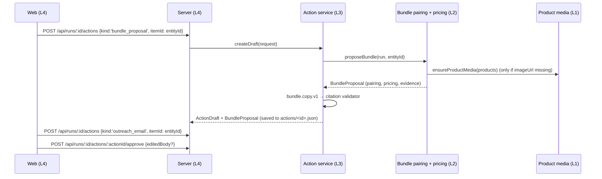

# M4: Collab Studio

| Field | Value |
| --- | --- |
| Requires | M1 green (M2 and M3 optional; they enrich the copy and add entry points) |
| Preset | `MILESTONES=m1,m4` (or any combination with m4) |
| Target green | Sun 02:00 (in parallel with M3) |
| Strengthens | Shopify, Rox ("takes meaningful action"), OpenAI |
| Card format / agent loop | [README §4](./README.md#4-working-with-agents) |

## 1. The product

> **"From insight to offer: the co-branded bundle and the pitch email, ready to send."**

On any collaborator card, click **Design a bundle** and get two things in seconds.

**A bundle mockup page** (product-page style):
- both brands' real product photos side by side
- the paired products (for example "Northbound House Espresso + Kettle & Pour Gooseneck Kettle 1L")
- a bundle price with the original total struck through
- a title, tagline, and description
- selling-point bullets, each with a citation chip
- a "Concept draft — not live" watermark

**An outreach email to the partner:** subject and body, the facts it uses footnoted with citations, and the proposed first validation step.

Both are **drafts**: the merchant edits, approves, then copies the email or downloads the mockup as PNG. **Nothing is ever sent automatically.**

With M4's flags off, the product is exactly what it was before.

## 2. Flow



## 3. Contract changes (additive; bump `SCHEMA_VERSION` minor)

```ts
// contracts/src/collect.ts (L1)
interface ProductSummary { /* existing fields */ imageUrl?: string; productId?: string /* Shopify GID when known */; handle?: string }

// contracts/src/report.ts (L3)
interface BundleProposal {
  id: string; runId: string; collaboratorEntityId: string;
  merchantProduct: ProductSummary; partnerProduct: ProductSummary;
  pairing: { score: number; reasons: string[]; evidenceIds: string[] };      // computed by L2
  pricing: { componentsTotal: Money; bundlePrice: Money; discountPct: number;
             rule: string; warnings: string[] };                             // computed by L2
  copy?: { title: string; tagline: string; description: string; bullets: Claim[] };  // written by L3
  status: 'draft' | 'approved' | 'discarded';
}
interface ActionDraft { /* existing fields */ bundleProposalId?: string; subject?: string }
```

**M4-C0 · Contract PR (L3, 15 min, before all other M4 cards):** add the `ProductSummary` fields (`collect.ts`, acked by L1), `BundleProposal`, and the `ActionDraft` fields (`report.ts`) in one PR. Types only.

Seed additions come with the feature cards: `fixtures/seed/northbound/actions/act_seed_bundle.json` and `act_seed_email.json` (L3), placeholder product images `apps/web/public/seed/{espresso,kettle}.svg` (L4), and `imageUrl` values pointing at those in `raw-signals.json` / `discover.json` (L1).

**Cross-lane calls are injected, not imported:** L3's action service receives `proposeBundle` (L2) and `ensureProductMedia` (L1) as dependencies, wired in L4's composition root. Each card tests with fakes.

## 4. Flags and config
`FEATURE_ACTIONS` (drafts and approval) and `FEATURE_BUNDLE_STUDIO` (mockup page), via preset `m4`. `BUNDLE_DISCOUNT_PCT` (default `10`) and `BUNDLE_MIN_RATIO` (default `0.85`).

---

## 5. Work split

| Lane | Cards | Human-only |
| --- | --- | --- |
| **L1** | M4-L1-1 | Check real product images load (CDN hotlinking, https) |
| **L2** | M4-L2-1 | Sanity-check pairings for 3 collaborators on 2 real stores |
| **L3** | M4-L3-1, M4-L3-2 | Read 5 generated emails; tune the tone; confirm no invented facts |
| **L4** | M4-L4-1, M4-L4-2 | Design taste on the mockup; record the demo flow |

### Lane 1: Collection

#### M4-L1-1 · Product media and identifiers
- **Brief:**
  - **Going forward:** populate `imageUrl` (first image, https), `productId` (GID when known), and `handle` in the `/products.json` mapper (M1-L1-3) and the Global Catalog mapper (`media[0].url`, `id`) (M1-L1-4).
  - **For runs recorded before M4:** `ensureProductMedia(products, ctx)` fills in missing images. It uses Storefront `/products/<handle>.json` via Fetch `raw` (merchant and partner storefronts), or catalog `lookup_catalog` by GID. It caches results and never throws; it returns products without images when lookup fails.
  - Update the seed `raw-signals.json` / `discover.json` with `imageUrl` pointing at `/seed/*.svg`.
- **Edit:** `packages/collect/src/shopify/{storefront,catalog}.ts` (mappers only), `packages/collect/src/shopify/media.ts`, `packages/collect/test/media.test.ts`, `fixtures/seed/northbound/{raw-signals,discover}.json`
- **Accept:** mapper tests on recorded spikes include `imageUrl`; `ensureProductMedia` fills missing images using recorded responses, and returns input unchanged on 404.

### Lane 2: Intelligence

#### M4-L2-1 · Bundle pairing and pricing (deterministic)
- **Brief:** `proposeBundle(runDir | io, collaboratorEntityId, ctx): BundleProposal` (without `copy`).
  - **Pairing:** over merchant sample products × the collaborator's matched products, maximize 0.5 × complement similarity + 0.3 × price-tier compatibility (design §7.1 price curve) + 0.2 × availability. Complement similarity = cosine between the product-title embedding and the collaborator's complement-job text from the plan. Break ties by higher rating count.
  - **Pricing:** `componentsTotal` = sum of the variants' min prices. `bundlePrice = floor(total × (1 − d)) − 0.01` in currency units, with d = `BUNDLE_DISCOUNT_PCT`, floored at `BUNDLE_MIN_RATIO × total`. If the currencies differ, there is no bundle price and a warning is added.
  - `pairing.evidenceIds` = the `product_record` evidence for both products.
  - Takes an injected `ensureProductMedia` dependency (default: pass products through unchanged) and calls it when images are missing.
- **Edit:** `packages/enrich/src/bundle-studio/**`, `packages/enrich/test/bundle-studio.test.ts`
- **Accept:** on the seed, `ent_kettle` pairs *Northbound House Espresso* with *Kettle & Pour Gooseneck Kettle 1L*; total $113.00 → bundle **$100.99** (`10099` minor units) at 10%; tests cover the floor rule and the currency mismatch.

### Lane 3: Reasoning & Pipeline

#### M4-L3-1 · Action service and bundle copy
- **Brief:**
  - `createActionService({ reasoner, store, proposeBundle, providers })` with `createDraft(request)`, `approve(actionId, approval)`, and `list(runId)`, persisting to `actions/<id>.json`.
  - For `bundle_proposal`: call `proposeBundle` (use the seed `act_seed_bundle.json` proposal until L2 merges), then prompt `bundle.copy.v1`. Input: both products, collaborator claims, and, **if present**, discourse unmet needs and praise themes (M2). Output: title, tagline, description, and 3–5 bullets as `Claim`s.
  - Run the citation validator; drop uncited factual bullets; if fewer than 2 bullets remain, retry once.
  - A `clipboard` `ActionProvider` (approve → returns the final text).
- **Edit:** `packages/reason/src/actions/**`, `packages/reason/src/prompts/bundle-copy.v1.ts`, `fixtures/seed/northbound/actions/act_seed_bundle.json`, `packages/reason/test/actions-bundle.test.ts`
- **Accept:** `FixtureReasoner` seed parity; live on seed inputs, every bullet cites evidence present in the proposal bundle; approving an unknown action ID errors.

#### M4-L3-2 · Outreach email draft
- **After:** M4-L3-1
- **Brief:** for `outreach_email` (`itemId` = collaborator entity), prompt `outreach-email.v1` produces a subject and a body addressed to the partner brand (no personal names; "Hi <Brand> team").
  - It covers: who we are (profile), why them (the collaborator's `whyMatch` claims), the proposal (the latest bundle proposal for that entity, if any, else the activation), what they get (`valueForPartner`, or the `partner_view` claims if M3 is on), and the first validation step.
  - Facts are footnoted, `[1]` style, mapped to evidence IDs.
  - Hard rules: no invented numbers, no promises of sales, ≤ 180 words.
- **Edit:** `packages/reason/src/actions/outreach.ts`, `packages/reason/src/prompts/outreach-email.v1.ts`, `fixtures/seed/northbound/actions/act_seed_email.json`, `packages/reason/test/actions-outreach.test.ts`
- **Accept:** seed parity; a validator test rejects a body containing a number that isn't in the cited evidence (a simple regex check over digits).

### Lane 4: Product & Platform

#### M4-L4-1 · Studio page (bundle mockup)
- **Brief:** route `/runs/:id/studio/:entityId` (registered only when `FEATURE_BUNDLE_STUDIO`). A PDP-style mockup:
  - two product images with a "+" between them
  - bundle title and tagline
  - price block: bundle price, struck-through components total, "Save N%"
  - bullets as `ClaimText`; "Includes" list with both brands' favicons
  - diagonal watermark "Concept draft — not live"

  Add seed placeholder SVGs. Entry points: a **Design a bundle** button on collaborator cards (top 3), and a node action on the map if M3's view is registered (check the registry; never import M3 code directly). A "Regenerate" button creates a new draft.
- **Edit:** `apps/web/src/features/studio/**`, `apps/web/public/seed/{espresso,kettle}.svg`, `apps/web/src/sections/collaborators/actions-slot.tsx`
- **Accept:** a component test renders the seed bundle with price $100.99, strikethrough $113.00, "Save 10%", and cited bullets; with flags off, no button or route exists.

#### M4-L4-2 · Drafts, approval, export, and M4 check
- **Brief:**
  - Server routes (registered via `registerRoutes('FEATURE_ACTIONS', …)`): `POST /api/runs/:id/actions`, `GET /api/runs/:id/actions`, `POST /api/runs/:id/actions/:actionId/approve`.
  - Studio side panel: email editor (subject and body) with footnotes resolved to the evidence drawer, **Approve**, then **Copy email** and **Download mockup (PNG)** via `html-to-image` (both disabled until approved), and a draft history list.
  - `evals/milestones/m4.test.ts`: a fully faked seed run with `MILESTONES=m1,m4` → create the bundle and email drafts for `ent_kettle` → assert pricing, citations resolve, and that export stays disabled until approval. `MILESTONES=m1` → routes return 404.
- **Edit:** `apps/server/src/routes/actions.ts`, `apps/web/src/features/studio/drafts/**`, `evals/milestones/m4.test.ts`
- **Accept:** `pnpm milestone:check m4` is green; earlier checks are still green.

---

## 6. Integration
- Live: on a recorded real M1 or M2 run, create bundles for the top 3 collaborators. Check the images load, the pairing makes sense, the price is right, and the bullets are cited.
- Then run a fresh live run with `m4` enabled end to end.
- Record the studio flow for the backup video.

## 7. Exit checklist: M4 is a complete product when
- [ ] `pnpm milestone:check m4` is green; earlier checks are still green.
- [ ] For any top-3 collaborator on 2 real stores: mockup + email generated in < 30 s, with real product images.
- [ ] Every factual bullet and email fact is cited; approval is required before copy or download.
- [ ] Works on runs recorded before M4 (media filled on demand).
- [ ] Deployed with the new preset; tag `m4-green`.

## 8. Demo if we stop here (90 s)
M1 beats (compressed to 40 s), then:
1. On the top collaborator: **Design a bundle** → the mockup appears with both brands' real photos and a priced bundle. (20 s)
2. "Every selling point is backed by evidence." Click a bullet's chip → the review quote. (10 s)
3. The email panel: "the pitch is drafted from the same receipts; the merchant approves before anything leaves." Approve → Copy. (20 s)

## 9. Improvement slots that fit M4
IS-COMPOSIO (save the approved email to Gmail drafts), IS-EXPORT, IS-SENTRY.

## 10. Risks and fallbacks

| Risk | Fallback |
| --- | --- |
| Product images hotlink-blocked | Proxy through `GET /api/media?url=` (L4, allowlisted to Shopify CDNs), or show a styled placeholder with the product name |
| Weak pairing (odd product combo) | Show the top 2 pairings with a "Swap product" dropdown (L2 returns the top 3 pairs; the UI picks) |
| Currency mismatch | No price; show "Set price" as a warning chip |

## 11. Hooks this milestone leaves for later
- **Approved `BundleProposal` is exactly the input M5 needs** to create a draft product in Shopify.
- **`ActionProvider` registry:** clipboard now; Composio (IS-COMPOSIO) and Shopify Admin (M5) plug in without UI rewrites (the UI lists the available providers for an approved draft).
