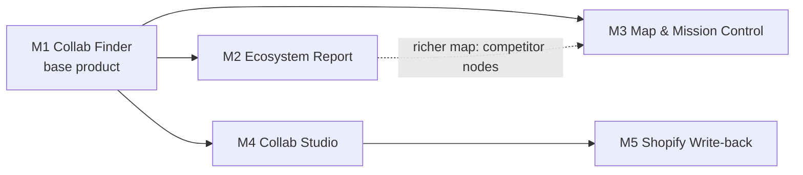

# Milestones: shippable increments

| Field | Value |
| --- | --- |
| Reference architecture | [`../SHOPIFY_ECOSYSTEM_INTELLIGENCE_DESIGN.md`](../SHOPIFY_ECOSYSTEM_INTELLIGENCE_DESIGN.md) ("design §N") |
| Lane ownership + working agreements | [`../TEAM_WORK_SPLIT.md`](../TEAM_WORK_SPLIT.md) ("split §N") |
| Deadline | Devpost **Sun 2026-09-20 08:00 EDT**; submit by 07:30; **feature freeze 04:00** |

The design doc describes the whole system. These files cut it into **five products**, each complete and demoable on its own. Every milestone after M1 is an add-on that composes with the others through flags. The four lanes from the split doc keep their ownership in every milestone.

---

## 1. The ladder

| ID | Product | One-line pitch | Requires | Target green | Strengthens |
| --- | --- | --- | --- | --- | --- |
| **M1** | [Collab Finder](./M1_COLLAB_FINDER.md) | "Find your next Shopify collab partner in 2 minutes, with receipts." | — | Sat 18:00 | Shopify, Browserbase, Baseten, OpenAI |
| **M2** | [Ecosystem Report](./M2_ECOSYSTEM_REPORT.md) | "Partners, rivals, what their customers say, and what to do next." | M1 | Sat 22:30 | Rox, OpenAI, Baseten |
| **M3** | [Map & Mission Control](./M3_MAP_AND_MISSION_CONTROL.md) | "Watch a swarm of browsers map your ecosystem live." | M1 (richer with M2) | Sun 02:00 | Finalist, Browserbase |
| **M4** | [Collab Studio](./M4_COLLAB_STUDIO.md) | "From insight to offer: the bundle mockup and the pitch email, ready to send." | M1 | Sun 02:00 | Shopify, Rox |
| **M5** | [Shopify Write-back](./M5_SHOPIFY_WRITEBACK.md) | "It doesn't just recommend the bundle, it builds it in your store (as a draft)." | M4 | Sun 03:45 (optional) | Shopify, Rox |



**Recommended order:** M1 → M2 → (M3 ∥ M4) → M5. M2, M3, and M4 each depend only on M1, so if one stalls the others still ship. Valid shippable combinations include `m1`, `m1+m4`, `m1+m2`, `m1+m2+m3`, `m1+m2+m3+m4`, and `m1+m2+m3+m4+m5`.

---

## 2. Rules that keep every milestone a complete product

1. **Shippable means** the milestone's exit checklist passes, the build is deployed, 2 demo runs are recorded, and its 60-second pitch works without mentioning later milestones.
2. **Additive only.** With a milestone's flags off, the product behaves exactly as before it existed. Contract changes are additive (split §11.3). A milestone never edits an earlier milestone's behavior; it registers new stages, sections, views, routes, or providers.
3. **Composable presets.** `MILESTONES=m1,m2,m4` enables the union of those milestones' sections and flags (§3). An explicit `FEATURE_*=true|false` env var overrides the preset.
4. **Graceful absence.** The UI renders only registered and enabled sections and tabs. Anything that reads another milestone's output must handle it being missing (for example, the map without competitor nodes).
5. **Always ship the highest green combination.** At the 04:00 freeze, anything not green is flagged off.
6. **Same four lanes in every milestone.** Each milestone file has its own 4-way split, and ownership never changes (split §1).
7. **Improvements attach through slots** (§6): small flag-gated add-ons that aren't required for any exit. Any lane with slack can pick one up.
8. **Contracts first.** A milestone with contract changes starts with card `M<N>-C0`. The integration captain (L3) lands **all** of that milestone's type additions in one PR within 15 minutes; the owning lanes ack it (CODEOWNERS). Every other card starts from that commit, so no card waits on another lane's types.
9. **One file per new seed section.** Seed data for a section added by a milestone goes in `fixtures/seed/northbound/sections/<key>.json`, never into `report.json` directly, so two lanes never edit the same JSON file. After the milestone's cards merge, L3 regenerates the assembled seed report with `pnpm pipeline:run --run-dir fixtures/seed/northbound --from assemble`.

---

## 3. Milestone presets

`packages/core/src/milestones.ts` (created in card M1-L4-0):

| Milestone | Report sections it adds | Flags it turns on | Routes/views it registers |
| --- | --- | --- | --- |
| `m1` | `collaborators` | — (base) | Intake, profile review, live run, Collaborators tab, evidence drawer |
| `m2` | `competitors`, `discourse`, `swot`, `actions` | `FEATURE_FULL_REPORT` | Competitors & Discourse tab, SWOT & Actions tab |
| `m3` | `ecosystem_map`, `partner_view` | `FEATURE_MAP`, `FEATURE_MISSION_CONTROL`, `FEATURE_PARTNER_VIEW` | Map hero view, mission-control grid, partner panel |
| `m4` | — (on-demand actions) | `FEATURE_ACTIONS`, `FEATURE_BUNDLE_STUDIO` | `/runs/:id/studio/:entityId`, `POST /api/runs/:id/actions`, `POST /api/runs/:id/actions/:actionId/approve` |
| `m5` | — | `FEATURE_SHOPIFY_WRITEBACK` | Connected-store badge, "Create draft in Shopify", `POST /api/runs/:id/actions/:actionId/execute` |

```ts
// packages/core/src/milestones.ts
export type MilestoneId = 'm1' | 'm2' | 'm3' | 'm4' | 'm5';
export interface MilestonePreset { sections: SectionKey[]; flags: string[]; requires: MilestoneId[] }
export const MILESTONE_PRESETS: Record<MilestoneId, MilestonePreset> = {
  m1: { sections: ['collaborators'], flags: [], requires: [] },
  m2: { sections: ['competitors', 'discourse', 'swot', 'actions'], flags: ['FEATURE_FULL_REPORT'], requires: ['m1'] },
  m3: { sections: ['ecosystem_map', 'partner_view'], flags: ['FEATURE_MAP', 'FEATURE_MISSION_CONTROL', 'FEATURE_PARTNER_VIEW'], requires: ['m1'] },
  m4: { sections: [], flags: ['FEATURE_ACTIONS', 'FEATURE_BUNDLE_STUDIO'], requires: ['m1'] },
  m5: { sections: [], flags: ['FEATURE_SHOPIFY_WRITEBACK'], requires: ['m4'] },
};
// resolveMilestones(env.MILESTONES ?? 'm1') → { sections, flags } ; throws if a required milestone is missing
```

The runner passes `sections` into `ReportRun.options.sections` (design §4.6). The planner, collectors, and synthesizers only do work for enabled sections.

---

## 4. Working with agents

The team mostly directs coding agents. The bottleneck is **human attention and real-API verification**, not typing. Everything below exists to protect those two things.

### 4.1 Cards
Every task in the milestone files is a **card** you can paste straight into an agent:

```text
#### M1-L1-3 · Storefront profiler                    ← ID: milestone-lane-number
- Brief:      what to build, with design § references (the agent must read them)
- Edit:       the only paths the agent may create or modify
- Read only:  contracts, fixtures, spikes it must conform to
- In → Out:   files/functions consumed → produced
- After:      cards that must merge first (otherwise use fakes)
- Accept:     commands that must pass before the agent says "done"
- Human check: what you verify yourself before merging
```

### 4.2 Loop per card
1. `git worktree add ../htn-<card-id> -b <lane>/<card-id>` (one worktree per running agent, so agents never share a working copy), then run `pnpm install` inside it. Keep the main clone at a short path such as `C:\Code\htn-26`, so worktree paths stay under Windows' 260-character limit.
2. Give the agent: "Read `AGENTS.md`, then do this card:" + the card text.
3. When it claims done: run the **Accept** commands yourself, check that `git diff --stat main` touches only **Edit** paths, then do the **Human check**.
4. Merge (split §11.1), remove the worktree, and move the card to done in the team channel.

**Parallelism:** at most 3 running agents per person. Cards that share Edit paths or list `After:` run sequentially.

### 4.3 Human-only work (never delegate)
- First contact with any real API. Save the raw responses under `fixtures/spikes/`; agents write parsers against those, never against their memory of an SDK.
- Keys, accounts, deploy credentials, and sponsor-booth questions.
- Judging LLM output quality on real stores (prompt and weight tuning).
- Integration swaps (split §8) and recording demo runs.
- Anything that writes to an external system (M5).

### 4.4 `AGENTS.md` (created in the bootstrap; `CLAUDE.md` imports it)
It already exists at the repo root. When a rule changes, a human updates it in its own small PR. Required contents:
- A one-paragraph project summary with links to the design doc, split doc, and this folder.
- The lane → directory ownership table (split §11.2).
- Commands: `pnpm install`, `pnpm typecheck`, `pnpm test`, `pnpm fixtures:check`, `pnpm milestone:check <m>`.
- Rules:
  - Edit only the paths listed on your card.
  - Contracts change only additively, with the seed fixture updated in the same commit.
  - Tests never call live APIs; use fakes plus `fixtures/spikes/`.
  - LLM output schemas use `.nullable()`, never `.optional()`.
  - Never commit secrets or `.data/`.
  - Put the card ID in every commit message: `M1-L1-3: …`.
  - Run your card's Accept commands and paste their output before saying you're done.
- Definition of done: Accept passes, typecheck passes, no edits outside the Edit list, and new behavior sits behind the milestone's flag.

### 4.5 Codex and the OpenAI prize
Run as many cards as practical through **Codex**, and record the card IDs in `docs/CODEX_LOG.md`. The story for judges is concrete: *four people ran N Codex agents from a card system, contract-first, and fixtures kept parallel agents from colliding.* Work done by other agents doesn't count toward that prize.

---

## 5. Milestone exit ritual

For each milestone:
- [ ] Every card of the milestone is merged, and its Accept commands pass on `main`.
- [ ] `pnpm milestone:check <m>` is green. It runs the full pipeline on the seed with every stage faked, using that milestone's preset, and asserts section statuses and citation coverage. The `evals/milestones/<m>.test.ts` files are written by each milestone's L4 card.
- [ ] Two live runs on real stores pass the milestone's exit checklist. Record them to `fixtures/real/<slug>-<m>/`.
- [ ] Deploy with `MILESTONES` set to the new green combination; smoke-test the public URL; tag `<m>-green`.
- [ ] Update `docs/DEMO_SCRIPT.md` and the Devpost draft with this milestone's 60-second pitch.

---

## 6. Improvement slots (optional; attach to any milestone at or above "Min")

Each slot is one card, flag-gated and owned by one lane. Pick them up only when your lane's milestone cards are merged.

| Slot | Min | Lane | Flag | Est (agent + review) | Prize |
| --- | --- | --- | --- | --- | --- |
| IS-SENTRY | M1 | L4 | `SENTRY_DSN` set | 45 m | Sentry |
| IS-CAPTURE | M1 | L1 | `FEATURE_CAPTURE_MEDIA` | 45 m | Browserbase |
| IS-DOMAIN | M1 | L4 | — | 30 m + DNS wait | MLH GoDaddy, Shopify (agent profile) |
| IS-EXPORT | M1 | L4 | `FEATURE_EXPORT` | 45 m | Polish |
| IS-GPTZERO | M1 | L2 | `FEATURE_GPTZERO` | 1 h | GPTZero |
| IS-PG | M1 | L2 | `STORE=pg` | 1.5 h | MLH Tiger Data (with IS-TRENDS) |
| IS-DISTILL | M2 | L2 | `FEATURE_DISTILLED_TAGGER` | 2.5 h | Baseten |
| IS-ASK | M2 | L3 + L4 | `FEATURE_ASK` | 1.5 h | Rox, OpenAI |
| IS-POLICIES | M2 | L1 | `FEATURE_POLICIES` | 1 h | Shopify, Browserbase |
| IS-TRENDS | M2 | L2 + L4 | `FEATURE_TRENDS` | 1.5 h | MLH Tiger Data |
| IS-COMPOSIO | M4 | L3 | `FEATURE_COMPOSIO` | 1 h | Composio, Rox |

**Slot cards:**

#### IS-SENTRY · Sentry tracing, AI monitoring, logs, replay
- Brief: implement `SentryTelemetry` in `packages/telemetry` (design §15). Server: `@sentry/node` ≥ 10.28 with tracing, `openAIIntegration()`, and Logs; wrap each stage and each Browserbase/Baseten call in `ctx.telemetry.span`. Web: `@sentry/react` with tracing + Session Replay. `recordInputs/recordOutputs` stay false unless `NODE_ENV=development`. No-op when the DSN is empty.
- Edit: `packages/telemetry/**`, `apps/server/src/instrument.ts`, `apps/web/src/instrument.ts`
- Accept: `pnpm test`; one live run shows a trace with stage spans and `gen_ai.chat` spans in Sentry.
- Human check: find one real slow span or error and write it down for the demo.

#### IS-CAPTURE · Capture screenshots and replay links
- Brief: in `withSession`, save a screenshot per extracted page to the BlobStore and set `Capture.artifactUri`. Ensure every session-captured `EvidencePreview` gets `replayUrl`. Additive field `EvidencePreview.screenshotUrl?` is served by `GET /api/artifacts/:runId/:file` (L4 adds a 10-line route; coordinate).
- Edit: `packages/collect/src/browserbase/**`, `packages/contracts/src/report.ts` (additive `screenshotUrl?` only; L3 acks), the seed fixture
- Accept: `pnpm test`; the evidence drawer on a live run shows the screenshot and a working "Watch capture" link.

#### IS-DOMAIN · Custom domain, HTTPS, UCP agent profile
- Brief: register the domain (GoDaddy Registry), point it at the deploy, have Caddy issue the TLS cert, serve `/ucp/agent-profile.json` (design §6.4) as a static file, and set `SHOPIFY_UCP_AGENT_PROFILE_URL` to it.
- Edit: `apps/server/public/ucp/agent-profile.json`, `Caddyfile`, `docker-compose.yml`
- Accept: `curl https://<domain>/ucp/agent-profile.json` returns JSON; one Global Catalog call succeeds with it.

#### IS-EXPORT · Report export
- Brief: `GET /api/runs/:id/export.md` renders the report as Markdown with numbered footnote citations (quote, URL, date), plus a "Download" button. Print CSS for a clean browser-to-PDF.
- Edit: `apps/server/src/routes/export.ts`, `apps/web/src/features/export/**`
- Accept: the export for the seed report contains every section and ≥ 1 footnote per claim.

#### IS-GPTZERO · Review authenticity + report check
- Brief: an `EvidenceScorer` calls GPTZero's AI-detection API on review/comment evidence (batched) and writes `Enrichment.scores.ai_generated`. Scoring down-weights evidence where `ai_generated ≥ 0.8` (never deletes it). The report shows "N reviews flagged as likely AI-generated". Optional `Verifier`: send claims + cited URLs to GPTZero's hallucination/citation check and surface the findings as warnings. Confirm endpoints at the GPTZero booth.
- Edit: `packages/enrich/src/gptzero/**`, `packages/enrich/src/score/**` (weighting only)
- Accept: unit tests with recorded responses; a live run shows the flag count.

#### IS-PG · Postgres stores
- Brief: design §10.1 with Drizzle. Implement `PgRunStore`, `PgEvidenceStore`, and `PgVectorIndex` (untyped `vector` + `model` column). Selected with `STORE=pg`; the file store stays the default.
- Edit: `packages/db/**`
- Accept: the store contract test suite (the same tests as `FileRunStore`) passes against Docker Postgres.

#### IS-DISTILL · Baseten distillation
- Brief: design §6.2 stack-up. Label ~1–2k units with the reasoning model through `Reasoner`, then fine-tune a small classifier on a Baseten H100 workstation (`ml/baseten/distill/`) and deploy it with BEI. A `DistilledTagger` takes over `discourseType` and sentiment, and `ml/baseten/distill/report.md` compares agreement, items/s, and $/1k units.
- Edit: `ml/baseten/distill/**`, `packages/enrich/src/baseten/distilled.ts`
- Accept: the comparison table exists; `FEATURE_DISTILLED_TAGGER=true` produces valid enrichment on a real run.

#### IS-ASK · Ask the evidence
- Brief: `POST /api/runs/:id/ask {question}` → `selectBundle` using the question as the query → `ask.answer` prompt → `Claim[]` validated by the citation validator. A chat panel on the report page.
- Edit: `packages/reason/src/ask/**` (L3), `apps/server/src/routes/ask.ts` + `apps/web/src/features/ask/**` (L4)
- Accept: on the seed, "Why is Summit Roast criticized?" returns claims citing `ev_seed_07` / `ev_seed_09`.

#### IS-POLICIES · Competitor shipping and returns policies
- Brief: a Stagehand adapter for `/policies/shipping-policy` and `/policies/refund-policy` on competitor storefronts. It extracts the free-shipping threshold, return window, and subscription terms as `policy` evidence, feeding SWOT threats.
- Edit: `packages/collect/src/adapters/policies.ts`
- Accept: replay test; a live run on 2 competitors returns thresholds with citations.

#### IS-TRENDS · Sentiment over time
- Brief: L2 aggregates dated discourse evidence into monthly sentiment series per competitor (a Tiger Data hypertable when `STORE=pg`, in-memory otherwise), exposed as an additive `trends` section. L4 renders a small-multiples line chart in the Competitors tab.
- Edit: `packages/enrich/src/trends/**`, `apps/web/src/sections/trends/**`
- Accept: the seed shows the Summit complaint trend; a live run shows ≥ 2 series.

#### IS-COMPOSIO · Execute approved drafts
- Brief: a `composio` `ActionProvider` creates a Gmail **draft** (never sends) from an approved outreach email. Button: "Save to Gmail drafts".
- Edit: `packages/reason/src/actions/composio.ts`
- Accept: an approved seed draft appears in a test Gmail account's drafts.

---

## 7. Timeline and cut rules

This assumes Step 0 starts Sat 12:00. If it starts later, shift the targets, but **never move the 04:00 freeze**.

| Window | Work |
| --- | --- |
| 12:00–13:30 | Step 0 (split §3 + card M1-L4-0) |
| 13:30–18:00 | M1 cards → M1 integration → **M1 green** |
| 18:00–22:30 | M2 cards (lanes may pre-start M3/M4 cards behind flags once their M2 cards merge) |
| 22:30–02:00 | M3 ∥ M4 (each person runs one M3 and one M4 card at a time) |
| 02:00–03:45 | M5 if M4 was green by 02:30; otherwise improvement slots |
| 04:00 | **Feature freeze**: ship the highest green combination; flag everything else off |
| 04:00–07:30 | Rehearse, record backup video, write Devpost, **submit 07:30** |

**Cut rules:**
- M1 not green by 19:00 → nobody starts M2 cards; everyone swarms M1.
- M2 not green by 23:30 → keep M2 flagged off and start M4 (the fastest visible win). Finish M2 only if time remains.
- M5 only starts if M4 is green by 02:30 **and** its write-back spike (M5 §4) passed.
